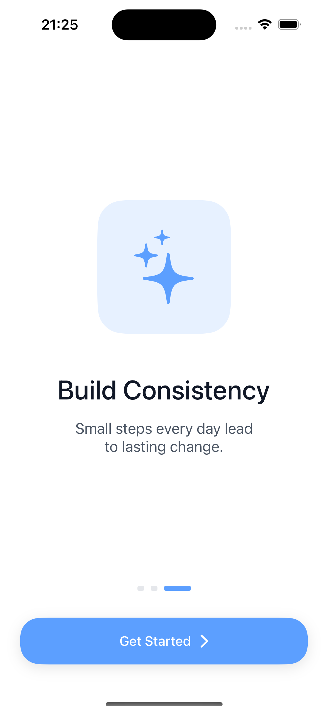
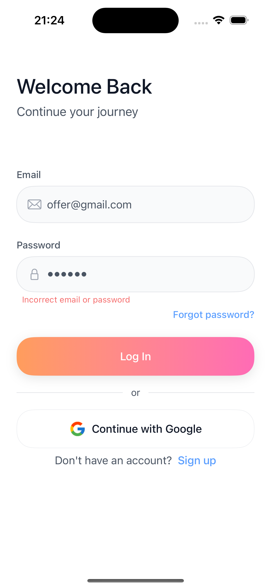

# 100 Days Challenge

A focused iOS habit-tracking app designed to help users build consistency through a 100-day commitment.

**Purpose.** Most habit apps overwhelm users with features or hide progress in lists. 100 Days Challenge focuses on one principle: commit to a habit for 100 days and track it visually. Built with SwiftUI, Firebase Auth, and Core Data, it combines focused UX with production-ready architecture.

### Preview

**Main app**

| Progress | New Challenge | Settings |
|:--------:|:-------------:|:--------:|
|  |  |  |

**Onboarding**

| Set Your Goal | Track Your Progress | Build Consistency |
|:-------------:|:------------------:|:-----------------:|
|  |  |  |

**Auth**

| Login | Sign Up | Login (error state) |
|:-----:|:-------:|:-------------------:|
|  |  |  |

---

## Key Features

- **100-Day Habit Grid** — Visual 10×10 grid to track and toggle completed days; swipe gestures to switch between challenges
- **Multi-Challenge Support** — Run up to 3 challenges at once with custom titles, start dates, and accent colors
- **Authentication** — Email/password sign-up and sign-in, Google Sign-In, email verification flow, and password reset
- **Onboarding** — 3-slide intro explaining goal-setting, progress tracking, and consistency
- **Settings & Challenge Management** — View all challenges, delete with confirmation, account and support links, sign out

---

## Tech Stack

- **SwiftUI** — Declarative UI
- **Firebase** — Auth (Email/Password + Google Sign-In)
- **Core Data** — Local persistence for challenges
- **Combine** — Reactive root routing via CombineLatest4 (splash, onboarding, user, auth state)
- **Swift Concurrency** — `@MainActor` on ViewModels and stores; `async`/`await` for `reloadUser()` and email verification checks
- **os.Logger** — Structured logging in `PersistenceController` and `ChallengeStore` for Core Data load/save and migration failures
- **Migration** — Idempotent one-time migration from UserDefaults → Core Data (deduplicates by id, skips existing entities, removes key on success)

---

## Architecture

**MVVM** with feature-scoped ViewModels and shared stores:

| Layer | Responsibility |
|-------|-----------------|
| **AppState** | Single source of truth for root route (`splash` → `onboarding` → `auth` → `verifyEmail` → `main`); derives route from splash flag, onboarding completion, and Firebase `user` |
| **AuthViewModel** | Login, sign-up, Google Sign-In, email verification, password reset, form validation, error mapping |
| **ChallengeStore** | Core Data CRUD, day toggling, max 3 challenges; `@Published challenges` consumed by views |
| **ProgressViewModel** | Current challenge index, swipe navigation, day toggle/complete with confirmation alerts |
| **NewChallengeViewModel** | Form state, color selection, submission, max-challenges alert |
| **OnboardingViewModel** | Slide index and content |
| **SettingsViewModel** | Challenge deletion state |

---

## Persistence

- **Core Data** — `ChallengeEntity` (id, title, accentColor, startDate, completedDaysData). `PersistenceController` manages container; `ChallengeStore` performs fetches and saves.
- **UserDefaults** — Only `hasCompletedOnboarding`; challenges migrated away from UserDefaults.
- **Migration** — One-time, idempotent migration from UserDefaults key `"challenges"` to Core Data: deduplicates by id, skips existing entities, removes key after success. Handles empty or malformed data gracefully.

---

## Project Structure

```
100DaysChallenge/
├── App/
│   ├── DaysChallengeApp.swift     # Entry point, Firebase init, env objects
│   └── Root/
│       └── RootView.swift         # Root routing (splash / onboarding / auth / main)
├── Core/
│   ├── DesignSystem/
│   │   ├── Colors.swift           # Semantic colors, accent palette, hex init
│   │   ├── Typography.swift       # Font tokens (display, headings, body, labels)
│   │   ├── Spacing.swift          # Spacing + CornerRadius tokens
│   │   └── ViewModifiers.swift    # sectionHeaderStyle, authAlerts, BottomActionBar
│   ├── Models/
│   │   └── Challenge.swift        # Challenge model (id, title, accentColor, startDate, completedDaysSet)
│   ├── Persistence/
│   │   ├── PersistenceController.swift   # Core Data stack + UserDefaults migration
│   │   ├── ChallengeStore.swift          # CRUD, day toggle, load/save
│   │   ├── ChallengeEntity+Challenge.swift
│   │   └── DaysChallengeModel.xcdatamodeld
│   └── Utils/
│       ├── AppState.swift         # Root routing state
│       └── LocalizedStrings.swift  # NSLocalizedString wrapper
├── Features/
│   ├── Auth/
│   │   ├── AuthViewModel.swift
│   │   ├── LoginView.swift
│   │   ├── SignUpView.swift
│   │   └── VerifyEmailView.swift
│   ├── NewChallenge/
│   │   ├── NewChallengeViewModel.swift
│   │   └── NewChallengeView.swift
│   ├── Onboarding/
│   │   ├── OnboardingViewModel.swift
│   │   ├── OnboardingView.swift
│   │   └── SplashView.swift
│   ├── Progress/
│   │   ├── ProgressViewModel.swift
│   │   ├── ProgressView.swift
│   │   └── MainTabView.swift
│   └── Settings/
│       ├── SettingsViewModel.swift
│       └── SettingsView.swift
└── SharedUI/
    └── Components/
        ├── ChallengeGrid.swift    # 100-day grid
        ├── DayCell.swift
        ├── FlowLayout.swift       # Wrapping layout for quick ideas
        ├── InputField.swift
        ├── PrimaryButton.swift
        └── ProgressBar.swift
```

---

## Getting Started

### Requirements

- iOS 17.0+
- Xcode 15.0+
- Swift 5.9+

### Installation

1. Clone the repository:
   ```bash
   git clone <YOUR_REPO_URL>
   cd 100DaysChallenge
   ```

2. Open `100DaysChallenge.xcodeproj` in Xcode.

3. Configure Firebase:
   - Create a Firebase project at [Firebase Console](https://console.firebase.google.com)
   - Add an iOS app with a bundle ID matching your Xcode project (see `PRODUCT_BUNDLE_IDENTIFIER` in project settings)
   - Download `GoogleService-Info.plist` and add it to the project root (the project references `GoogleService-Info.plist` at repo root)
   - Enable **Email/Password** and **Google** authentication in Firebase Console

4. Build and run on a simulator or device.

---

## Product Notes / UX

**Flow:** Splash (2s) → Onboarding (3 slides) → Auth (login/sign-up) → Email verification (if needed) → Main tab (Progress | New Challenge | Settings).

- **Progress tab:** Empty state when no challenges; otherwise challenge switcher dots, stats (X/100 days), progress bar, 100-day grid, and “Mark Day N Complete” button when today is not done.
- **New Challenge tab:** Title input, quick-idea tags, color picker, tips card, “Start Challenge” CTA. Max 3 challenges enforced with alert.
- **Settings:** Account (Profile, Notifications), Your Challenges (list + delete), Support (Help Center, Privacy Policy), Sign Out.

---

## Quality / Engineering Practices

- **Localization** — `LocalizedStrings` enum with `NSLocalizedString`; all user-facing text centralized.
- **Design system** — `Colors`, `Typography`, `Spacing`, `CornerRadius`; reusable `PrimaryButton`, `InputField`, `SectionHeaderStyle`, `BottomActionBar`.
- **Logging** — `os.Logger` in `PersistenceController` and `ChallengeStore` for Core Data load/save and migration failures.
- **Edge cases** — UserDefaults migration is idempotent; duplicate challenges filtered by id; rate limiting and cooldown for email verification resend; auth error mapping for user-friendly messages.

---

## Roadmap

- Sign in with Apple (requires Apple Developer Program enrollment)
- Cloud Firestore sync for challenges across devices
- Home screen widgets for “today’s challenge” and progress
- Localization for additional languages

---

## Project Status

Actively developed. App Store release planned. Persistence layer (Core Data + idempotent UserDefaults migration) is hardened and production-ready.

---

## Author

Designed and developed by **Nadia K**.

---

## License

MIT License. You may use, modify, and distribute this project under the terms of the MIT License.
